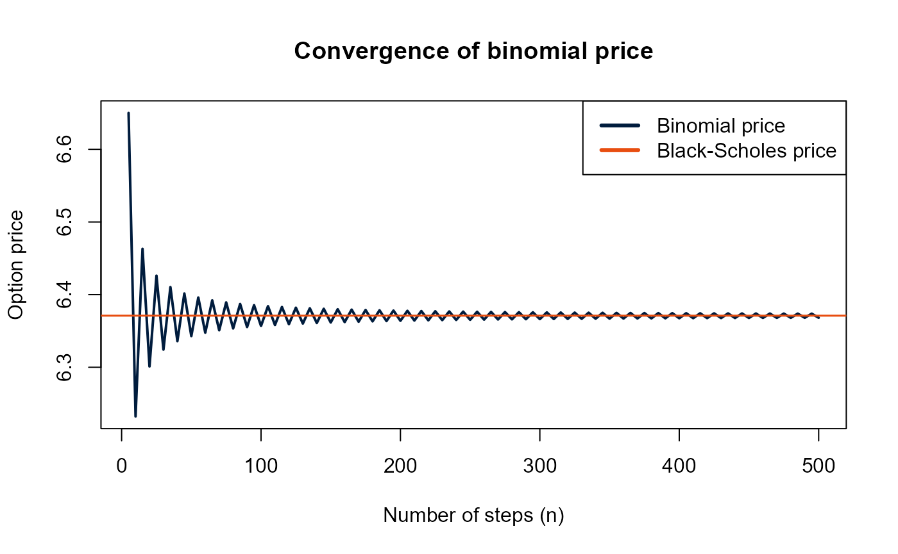

# How to use optionsLibrary

  

## Introduction

This vignette explains how to use the `optionsLibrary` package to price
European options and compute Greeks, including a simple application.  

The main syntax is defined as follows:

- Spot price $`S_0`$ = S

- Strike price $`K`$ = K

- Risk-free rate $`r`$ = r

- Dividend yield $`\delta`$ = q

- Volatility $`\sigma`$ = sigma

- Time to maturity $`T`$ = T

  

Now, load `optionsLibrary`.

``` r
library(optionsLibrary)
```

  

## Black-Scholes pricing

Computing a European call:

``` r
S <- 100
K <- 100
r <- 0.03
q <- 0
sigma <- 0.2
T <- 0.5
```

``` r
call_price <- bs_price(S, K, r, q, sigma, T, 'call')
call_price
```

    ## [1] 6.371028

  

Same for a European put:

``` r
put_price <- bs_price(S, K, r, q, sigma, T, 'put')
put_price
```

    ## [1] 4.882222

  

## Option Greeks

Greeks are easily computed in a similar fashion:

``` r
call_greeks <- bs_greeks(S, K, r, q, sigma, T, 'call')
call_greeks
```

    ## $Delta
    ## [1] 0.5701581
    ## 
    ## $Gamma
    ## [1] 0.02777213
    ## 
    ## $Theta
    ## [1] -7.07377
    ## 
    ## $Vega
    ## [1] 27.77213
    ## 
    ## $Rho
    ## [1] 25.32239

``` r
put_greeks <- bs_greeks(S, K, r, q, sigma, T, 'put')
put_greeks
```

    ## $Delta
    ## [1] -0.4298419
    ## 
    ## $Gamma
    ## [1] 0.02777213
    ## 
    ## $Theta
    ## [1] -4.118434
    ## 
    ## $Vega
    ## [1] 27.77213
    ## 
    ## $Rho
    ## [1] -23.93321

  
Output is in list form, allowing to isolate a specific greek:

``` r
call_greeks$Delta
```

    ## [1] 0.5701581

  

## Binomial tree pricing

``` r
n <- 100
```

``` r
call_binomial <- binomial_price(S, K, r, q, sigma, T, n, 'call')
call_binomial
```

    ## [1] 6.35698

``` r
put_binomial <- binomial_price(S, K, r, q, sigma, T, n, 'put')
put_binomial
```

    ## [1] 4.868174

  

## Binomial convergence to Black-Scholes

A nice application Using `optionsLibrary` is to plot the convergence of
the binomial price to the Black-Scholes price:

``` r
n_steps <- seq(5, 500, by = 5)
binomial_prices <- numeric(length(n_steps))
blackscholes_price <- bs_price(S, K, r, q, sigma, T, 'call')

for (i in seq_along(n_steps)) {
  n <- n_steps[i]
  binomial_prices[i] <- binomial_price(S, K, r, q, sigma, T, n, 'call')
}
```

``` r
plot(n_steps, binomial_prices, type = 'l', col = '#001c3d', lwd = 2, main = 'Convergence of binomial price', xlab = 'Number of steps (n)', ylab = 'Option price')
abline(h = blackscholes_price, col = '#e84e10', lwd = 1.5)
legend('topright', legend = c('Binomial price', 'Black-Scholes price'), col = c('#001c3d', '#e84e10'), lty = c(1, 1), lwd = c(3, 3))
```


